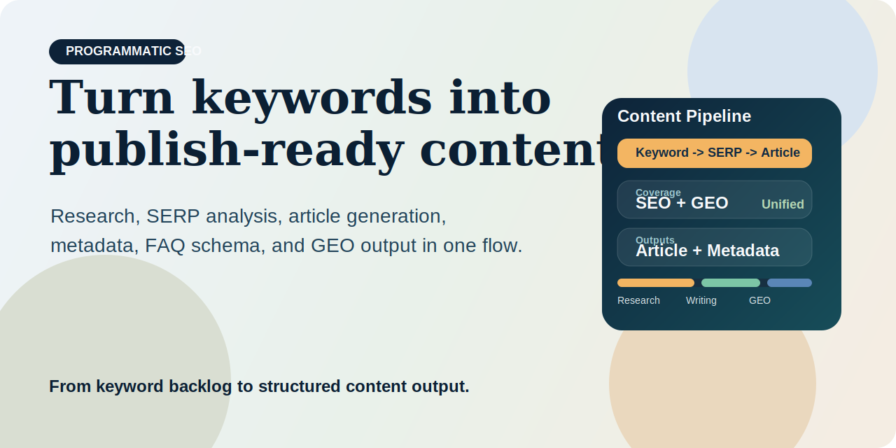

[](./LICENSE)
[](./skills/programmatic-seo-writer.md)
[](./skills/programmatic-seo-writer.md)

# SEO GEO Content Engine



> Turn keywords into search- and AI-ready content pipelines with automated research, SERP analysis, writing, and optimization.

**Positioning**

SEO GEO Content Engine is a content production system for teams that want more than one-off article generation.

It is designed to turn a target keyword into:

- validated search intent
- SERP-aware content structure
- publish-ready long-form content
- metadata and FAQ schema
- AI-friendly versions for answer engines

This project helps answer a practical growth question:

> How do you turn keyword opportunities into scalable content output without losing search quality or AI visibility?

**Outcome**

Instead of treating research, writing, metadata, and GEO optimization as separate tasks, this project organizes them into one repeatable pipeline.

## Why It Feels Different

Most AI writing tools start too late.

They generate articles before fully resolving:

- search intent
- SERP patterns
- content gaps
- metadata strategy
- AI-answer packaging

This project is built to start earlier and finish later:

- earlier with keyword and SERP analysis
- later with metadata, FAQ schema, and GEO-ready output

## What You Get

- one keyword-to-content workflow
- one reusable writing pipeline
- one structure for SEO and AI answer engines
- one output format that is ready for publishing or handoff

## Who This Is For

- content teams running programmatic SEO at scale
- founders who need faster content velocity without losing structure
- consultants producing repeatable content systems
- AI-native teams optimizing for both rankings and answer engines

## Pipeline


## What The System Produces

For one keyword, the pipeline can produce:

- keyword framing and expansion
- search intent analysis
- SERP-derived content structure
- full article draft
- title and meta description
- FAQ block with schema-ready output
- GEO version designed for AI-driven discovery

## Example Prompts

```text
write article: best llm observability tools
```

```text
create SEO content for ai seo tracking
```

```text
force framework B: programmatic seo for saas
```

```text
show available keywords
```

## Example Output

```text
Keyword
- ai seo tracking

Search Intent
- Commercial investigation

SERP Pattern
- Tool roundups dominate
- Buyers want comparisons, pricing visibility, and workflow examples

Content Package
- Title: 12 AI SEO Tracking Tools for 2026
- Meta Description: Compare the best AI SEO tracking tools for rankings, AI visibility, and prompt coverage.
- H1/H2 outline
- Full article draft
- FAQ section
- FAQ schema
- GEO version optimized for answer extraction
```

## Why Teams Use It

### Traditional Content Workflow

- keyword research in one tool
- SERP review in another
- article writing somewhere else
- metadata added later
- GEO considerations often missing

### With Programmatic SEO

- research, writing, metadata, and GEO live in one pipeline
- output follows one consistent structure
- teams can scale production without losing quality controls

## Skill Entry Point

The core skill lives here:

- [`skills/programmatic-seo-writer.md`](/Users/timlin/Downloads/programmatic-seo/skills/programmatic-seo-writer.md)

Use it when you want a repeatable SEO + GEO writing workflow rather than a generic text generator.

## Repo Structure

```text
seo-geo-content-engine/
├── README.md
├── LICENSE
├── assets/
│   └── cover.svg
└── skills/
    └── programmatic-seo-writer.md
```

## Recommended Use Cases

- build a scalable content backlog
- generate publish-ready SEO articles faster
- package content for both search and AI answers
- standardize content production across a team

## License

MIT
